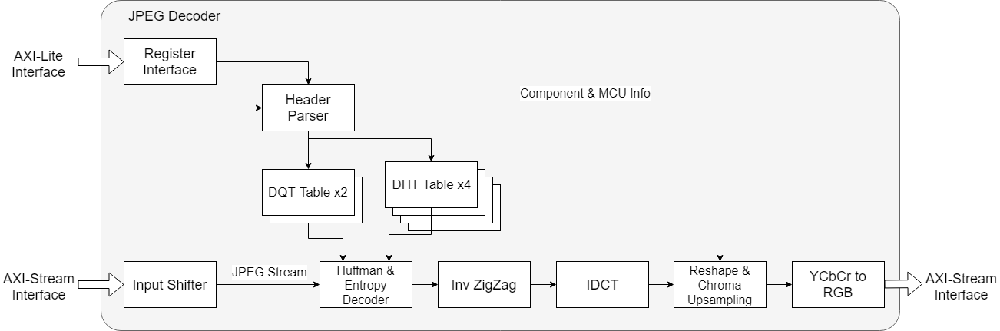
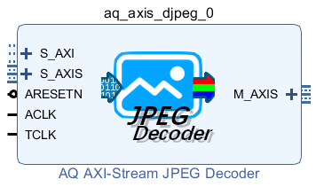
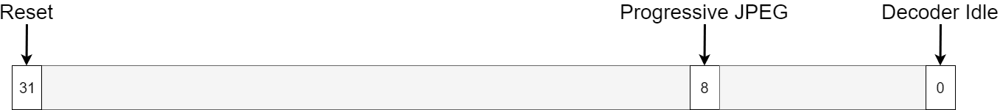
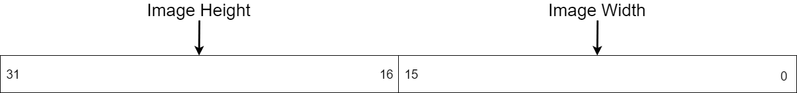
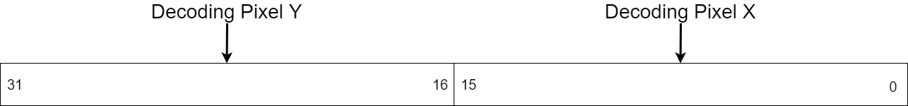
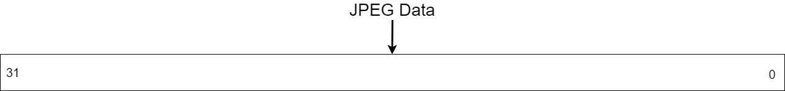
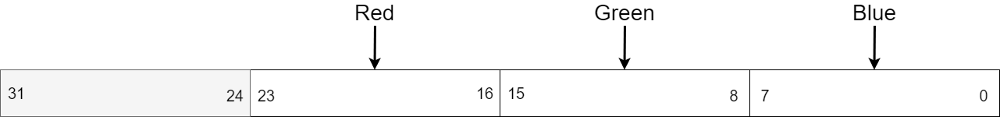
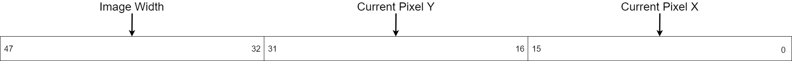

# AXI-Stream JPEG Decoder

## Introduction

AXIS JPEG Decoder is a JPEG baseline decoder with JPEG stream input and blocked stream output, both using AXI-Stream interface with included AXI-Lite monitoring interface.
Designed for decoding basic types of JPEG images as well as the first layer of progressive JPEGs.

The information of JPEG, including image size, baseline or progressive and color components are automatically extracted from the header of JPEG stream. JPEG data stream will be accepted through AXI-Stream input interface, while pixel stream and pixel position stream extracted through AXI-Stream output interface's TDATA and TUSER channels.

## Features

- ISO/IEC 10918-1 compliant JPEG Baseline decoding
- Up to 64K x 64K image resolution
- Dynamic quantization tables and Huffman tables
- Automatic JPEG header extractor for tables and image properties
- Supporting YCbCr 4:4:4, YCbCr 4:2:2H, YCbCr 4:2:2V, YCbCr 4:2:0 and monochrome inputs
- Supporting extraction on the first layer of progressive JPEG
- Supporting DRI label and restarts
- I/O AXI-Stream interface with full flow control
- AXI-Lite interface for manual reset and image properties reading
- Asynchronous operation between AXI-Lite interface and AXI-Stream interface
- Peak performance at 1clk/pixel

## Limitations

- Up to 2 8-bit Quantization Tables
- Up to 4 Huffman Tables (2 for DC, 2 for AC)
- Image SOF are required to be aligned with 4B boundary
- Only 1(Monochrome) or 3(YCbCr) image component types supported
- Corrupted frames are not supported
- Following layers of progressive JPEG are ignored
- Input AXI-Stream and output AXI-Stream are synchronous
- Fixed AXI-Stream width at 32 bits
- Fixed AXI-Lite address and data width at 32 bits

## Resource Utilization

| Device   | fACLK  | fTCLK  | LUT  | FF   | BRAM | DSP  |
| -------- | ------ | ------ | ---- | ---- | ---- | ---- |
| 7A100T-1 | 100MHz | 100MHz | 4580 | 4353 | 6    | 13   |

Synthesized and implemented with default config in Vivado 2018.3

## Port Descriptions

### Clocking and resets

|Signal Name|I/O|Description|
|-|-|-|
|ACLK|I|AXI-Lite clock|
|ARESETN|I|AXI-Lite reset, active-low|
|TCLK|I|AXI-Stream clock|

### AXI-Lite Interface

|Signal Name|I/O|Description|
|-|-|-|
|S_AXI_*|-|AXI-Lite bus for controlling|

### AXI-Stream Slave Interface

|Signal Name|I/O|Description|
|-|-|-|
|S_AXIS_*|-|AXI-Stream bus for JPEG stream input|

### AXI-Stream Master Interface

|Signal Name|I/O|Description|
|-|-|-|
|M_AXIS_*|-|AXI-Stream bus for pixel data output|

## Register Space

|Address Offset|Register Name| Description|
|-|-|-|
|0x0|A_STATUS|Decoder Status|
|0x4|A_SIZE|Decoding Image Size|
|0x8|A_PIXEL|Decoding Pixel Count|

- Decoder Status

    The Decoder Status register is a 32-bit r/w register. This register is used to monitor the status of decoder as well as initiating hard reset on the decoder.

    

    |Bits|Name|Access|Reset value|Description|
    |-|-|-|-|-|
    |31|Reset|Read/Write|1|1: Decoder Reset 0: Normal Operation|
    |8|Progressive|Read|0|1: The JPEG under decoding is progressive JPEG, only the first low-quality layer are being extracted 0: The JPEG under decoding is baseline JPEG, will be decoded with full quality|
    |0|Idle|Read|1|1: Decoder is idle 0: Decoder is busy|

- Decoding Image Size

    The Decoder Image Size register is a 32-bit r/o register. This register is used to read the size of the JPEG image under decoding.

    

    |Bits|Name|Access|Reset value|Description|
    |-|-|-|-|-|
    |31:16|Height|Read|0|The vertical size of the image under decoding|
    |15:0|Width|Read|0|The horizontal size of the image under decoding|

- Decoding Pixel Count

    The Decoder Pixel Count register is a 32-bit r/o register. This register is used to read the position of the currently pixel output on the M_AXIS bus.

    

    |Bits|Name|Access|Reset value|Description|
    |-|-|-|-|-|
    |31:16|Pixel Y|Read|0|The vertical position of the current pixel|
    |15:0|Pixel X|Read|0|The horizontal position of the current pixel|

## Stream Data Format

### S_AXIS: JPEG Stream Input

32-bit word input from JPEG data stream. The start of each JPEG, or the SOI marker are required to be aligned to the LSB. Other words in JPEG are automatically shifted and aligned.

- S_AXIS_TDATA Channel

    

    |Bits|Name|Description|
    |-|-|-|
    |31:0|Data|JPEG Stream Data|

### M_AXIS: Pixel Stream Output

32-bit pixel output stream in BGR888 format. The MSB byte is left empty to align pixel to 32-bit words. The horizontal size and output pixel counts are propagated through user channel to help generating target address for each pixel.

The **TREADY** signal is used to control the output pipeline which also propagates internal valid signal, so must *not* depend **TREADY**  upon **TVALID** or the pipeline may stuck.

The block size of output varies with the chroma subsampling type of the decoded JPEG. 

- For YCbCr 4:4:4 and monochrome, the output will be in 8x8 pixel blocks. 
- For YCbCr 4:2:2H, the output will be in 16x8 pixel blocks.
- For YCbCr 4:2:2V, the output will be in 8x16 pixel blocks.
- For YCbCr 4:2:0, the output will be in 16x16 pixel blocks.

Inside each block, pixels are outputted by rows. The row will be cut short at the right edge of the whole image. The sequence of rows will also be cut short at the bottom edge of the whole image.

- M_AXIS_TDATA Channel

    

    |Bits|Name|Description|
    |-|-|-|
    |23:16|Red|The red component of current pixel|
    |15:8|Green|The green component of current pixel|
    |7:0|Blue|The blue component of current pixel|

- M_AXIS_TUSER Channel

    

    |Bits|Name|Description|
    |-|-|-|
    |47:32|Image Width|The width of whole image in pixels|
    |31:16|Pixel Count Y|The vertical position of the current pixel|
    |15:0|Pixel Count X|The horizontal position of the current pixel|

- M_AXIS_TLAST Channel

    |Bits|Name|Description|
    |-|-|-|
    |0|TLAST|1: Current pixel is the last pixel in the current image|
